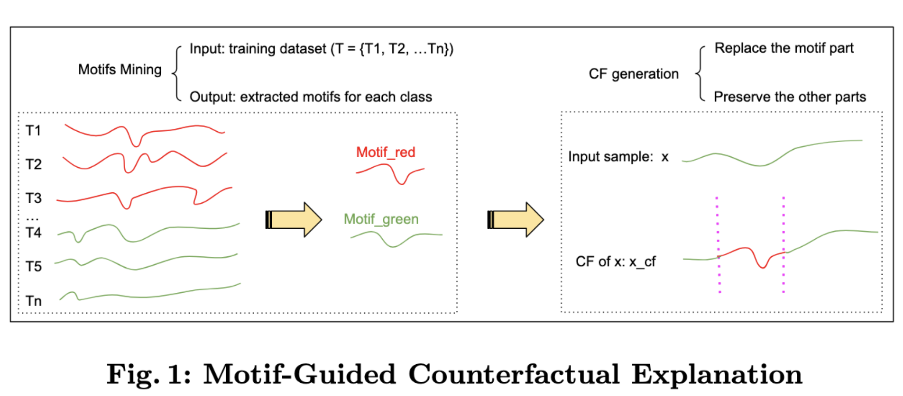

# Motif-guided time series counterfactual explanations
This is the repository for our paper also available on [ArXiv](https://arxiv.org/pdf/2211.04411.pdf)
 titled "Motif-guided time series counterfactual explanations". This paper has been accepted at the [2-nd Workshop on Explainable and Ethical AI – International Conference on Pattern Recognition, 2022](https://xaie-icpr.labri.fr/#Paper_submission)

# Approach

# Data
The data used in this project comes from the [UCR](https://www.cs.ucr.edu/~eamonn/time_series_data_2018/) archive.

# Prerequisites
All python packages needed are listed in [pip-requirements.txt](pip-requirements.txt) file and can be installed simply using the pip command.
